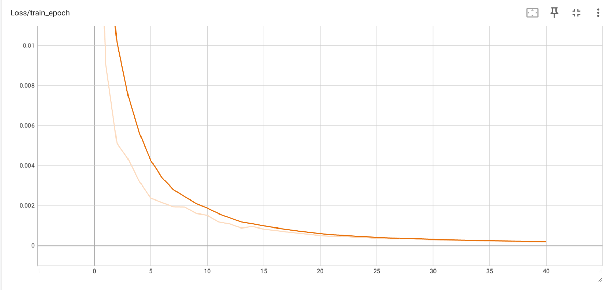
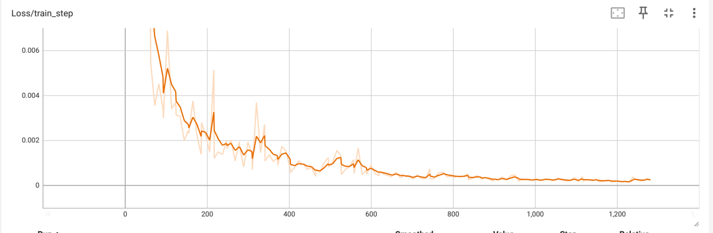

# 🚗 CarPilot-BC

基于**行为克隆（Behavioral Cloning）**与**时序建模**的端到端自动驾驶系统。

> 🎯 **项目定位**：衔接强化学习（RL）与视觉-语言-动作（VLA）学习的桥梁性练习项目，专注于**端到端模仿学习**的基础实践。

---

## ✨ 核心特性

| 特性 | 说明 | 优势 |
|:---|:---|:---|
| **🎮 EMA 平滑控制** | 指数移动平均插值算法 | 将离散键盘输入转化为连续物理信号，消除突变噪声，提升回归任务训练稳定性 |
| **⏱️ 时序数据采集** | 基于滑动窗口的多帧序列 | 捕获车辆动态信息，支持时序模型（CNN+Transformer） |
| **🏗️ CNN+Transformer 架构** | 空间特征 + 时序注意力 | 兼顾局部视觉感知与全局运动趋势预测 |
| **🔧 完整数据管线** | 采集 → 清洗 → 增强 → 训练 → 部署 | 可复现的端到端开发流程 |

## 📂 项目结构

\`\`\`text
CarPilot-BC/
├── data/               # 训练数据 (Git 忽略)
│   ├── frames/         # 采集的 96x96 驾驶画面
│   └── actions.csv     # 物理动作标签 [frame_id,steering, throttle, brake]
├── result/             # 存放训练好的 .pth 模型权重以及输出的图表信息
├── check_data.py       # 检查数据采集是非正确
├── clean_data.py       # 清除不良数据脚本
├── collect_data.py     # 数据采集脚本 (支持 EMA 平滑控制)
├── dataset.py          # 数据处理增强
├── drive.py            # 自动驾驶推理与测试脚本
├── model_arch.py       # 模型架构连接CNN+Transformer
├── train.py            # 训练脚本
├── test_env.py         # 验证数据采集环境
├── .gitignore          # 过滤大数据文件
\`\`\`

