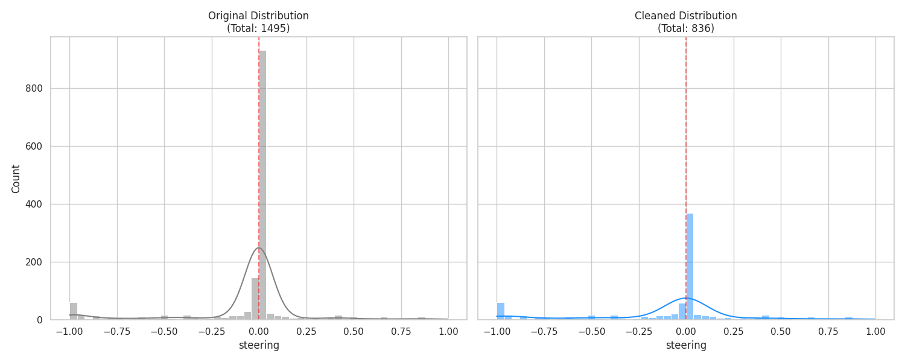

# CarPilot-BC

本项目使用 **ResNet18 + Transformer** 架构，通过行为克隆（Behavioral Cloning）实现 `Gymnasium CarRacing-v3` 环境下的自主驾驶。

**项目说明**：这是一个基于 PyTorch 的入门级深度学习项目，旨在通过简单的行为克隆（模仿学习）方法，让模型学习人类在 Gymnasium 赛车环境中的控制决策。本项目主要用于跑通“数据采集-模型训练-闭环部署”的完整流程，是视觉控制任务的一个基础练习，同时也是为了链接RL和VLA完成的基础训练。

---


## 技术实现
* **控制平滑化**：针对键盘离散输入的局限性，引入指数移动平均（EMA）进行逻辑插值，产出更适合回归模型拟合的连续动作标签。
* **特征提取**：使用简单的卷积神经网络（ResNet18）提取图像特征，并使用（TransFormers）处理时序特征，尝试捕捉车辆运动惯性。
* **数据流管线**：实现了一套轻量化的本地数据管理方案，包括实时采样存图、CSV 标注对齐及离群值清洗。


## 数据分布优化

在训练之前，我们对数据进行了人为手动清洗，目的在于把开的特别不好的部分删除；
还进行了降采样，解决了直道数据过剩导致的模型不转弯的问题;
对数据进行了水平翻转，增加数据量



**优化点：**
* **去尖峰处理**：去除了约 70% 的直道（转向角接近 0）样本，强制模型学习弯道特征。
* **数据增强**：通过水平翻转图像并将转向角取反，使左转和右转样本达到 1:1 的完美平衡。


## 模型架构 (Model Architecture)

模型采用时序特征提取方案，能够感知车辆的动态速度：
1. **Backbone (ResNet18)**: 提取每一帧 64x64 图像的空间视觉特征。
2. **Temporal (Transformer)**: 关联连续 5 帧图像，提取位移、速度和加速度特征。
3. **Controller**: 输出连续的控制向量 `[Steering, Throttle, Brake]`。


## 训练监控 (Training Monitor)

使用 TensorBoard 监控回归损失（MSE Loss）。

* **Loss 下降曲线**：通过调低学习率（1e-4），模型在处理极细微的控制信号时表现出更好的稳定性。
* **可视化**：在vscode中 启用TensorBoard查看详细曲线。

## 文件结构
```txt
CARPILOT-BC/
├── assets/                     # 可视化资源
│   ├── distribution_compare.png    # 数据分布对比图
│   ├── inference.gif               # 模型推理演示动画
│   ├── Loss_train_epoch.png        # 训练损失曲线（按epoch）
│   └── Loss_train_step.png         # 训练损失曲线（按step）
│
├── configs/                    # 配置文件
│   └── config.yaml                 # 训练/推理超参数配置
│
├── data/                       # 数据集（Git-LFS管理大文件）
│   ├── csv/                        # 动作标签CSV文件
│   └── frames/                     # 采集的图像帧
│
├── result/                     # 实验结果（自动按时间归档）
│   ├── 20260205-131346_lr0.0001.../    # 初期单次实验目录
│   ├── logs/                           # TensorBoard日志
│   └── models/                         # 历史模型归档
│
├── scripts/                    # 工具脚本
│   ├── data_cleaner.py             # 数据清洗（手动清除和自动降重）
│   ├── data_validator.py           # 数据验证（数据比较以及测试）
│   └── env_tester.py               # 环境测试（键盘控制采集）
│
├── src/                        # 核心源码
│   ├── data_collection.py          # 人类数据采集（Pygame+Gym）
│   ├── dataloader.py               # 数据加载与增强
│   ├── networks.py                 # 网络架构（CNN+Transformer）
│   ├── train.py                    # 训练主程序
│   ├── inference.py                # 模型推理与可视化
│   └── utils.py                    # 工具函数
│
├── .gitignore                  # Git忽略规则（排除data/、result/大文件）
└── README.md                   # 本文件